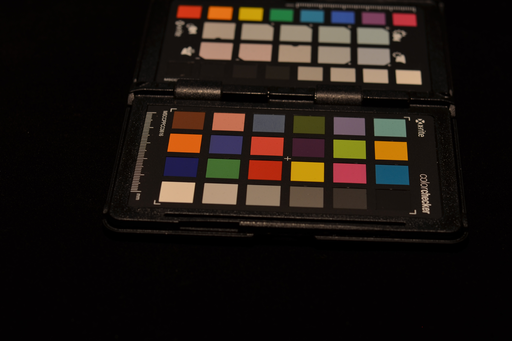
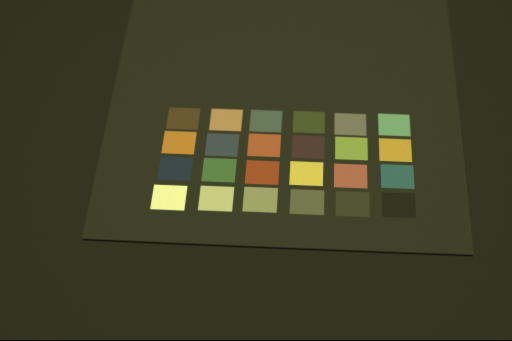
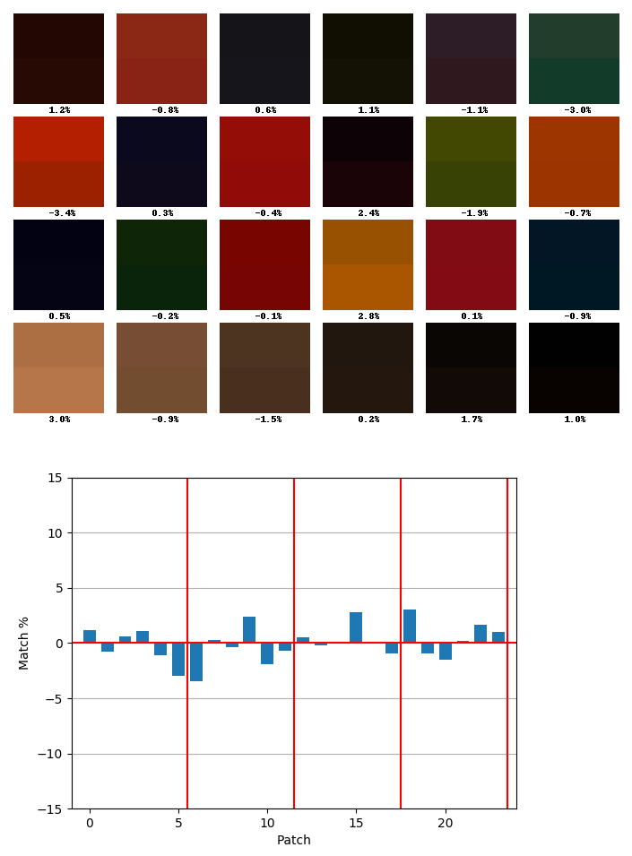
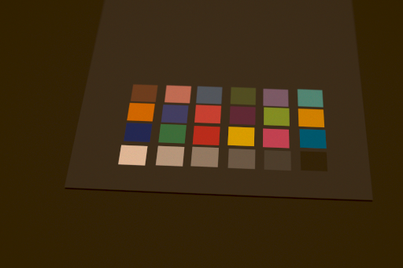
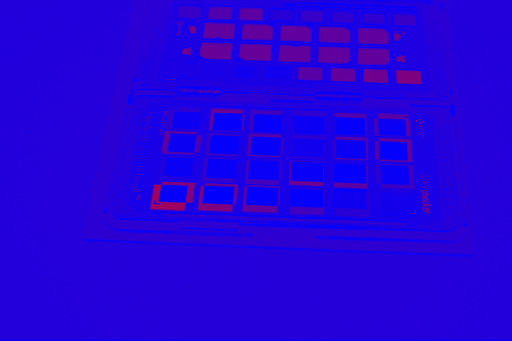

# Compute Color Correction Matrix (CCM)
We compute Color Correction Matrix A.
In other words, we calculate a 4x3 matrix A which approximate the following equation.  

Let P be a reference color checker matrix (24 x 3) and O be a color checker 
matrix to correct (24 x 3).  
`P = [O 1] A`




## Data
We have to prepare color checker patch data as csv format.
There are example data in `data` directory.
- `data/colorchart_photo_strobo_linear.csv`
- `data/colorchart_rendered_strobo_linear.csv`  

They are 24x3 matrix. The data are made by reading pixel values using [Natron2](https://natron.fr/)

## Dependency
- Python
    - numpy
    - matplotlib
    - Pillow 
    - OpenEXR
- C++
    - args.hxx

## Build c++ version of computeCCM

``` shell
$ cd cpp
$ mkdir build
$ cmake ../
$ make
```

## Usage
``` shell 
# computeCCM.py [-h] [-g GAMMA] reference_csv source_csv output_csv
$ computeCCM.py data/colorchart_photo_strobo_linear.csv data/colorchart_rendered_strobo_linear.csv ccm.csv
```
This command generates optimal Color Correction Matrix as csv file (`ccm.csv`)

## Test
We can compare reference data and corrected data using `plotChart.py`

``` shell
$ plotChart.py ccm.csv data/colorchart_photo_strobo_linear.csv data/colorchart_rendered_strobo_linear.csv ccm.csv chart
```


Each patch shows reference and corrected data. Upper one is reference and lower one is corrected color.
The numbers mean relative error.

# Color Correction
Correct given image using CCM.
`correctColor.py` reads jpg or png images, and
`correctColorExr.py` reads exr images.

## Usage
``` shell
$ correctColor.py ccm.csv reference.png corrected
```

  
corrected image

# Image Diff

Generate diff image between a reference image and a corrected image. We compute a difference between two images and take average of rgb for each pixels.

## Usage
``` shell
$ imageDiff.py photo_reference.png corrected.png
```


The difference is small as the color approaches blue and 
the difference is big as the color approaches red.

# References

* Raw-to-raw: Mapping between image sensor color responses. CVPR 2014. https://www.cv-foundation.org/openaccess/content_cvpr_2014/papers/Nguyen_Raw-to-Raw_Mapping_between_2014_CVPR_paper.pdf
